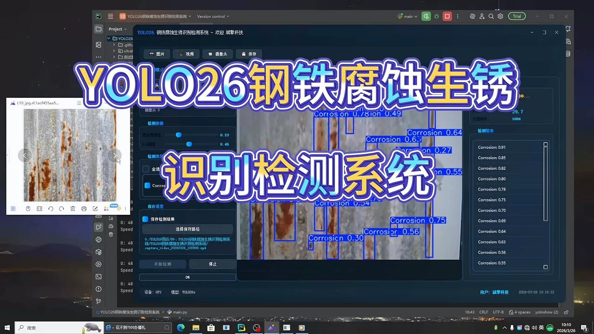
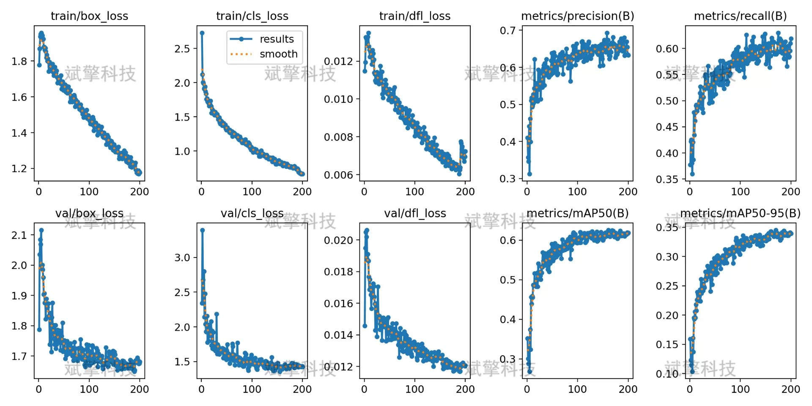
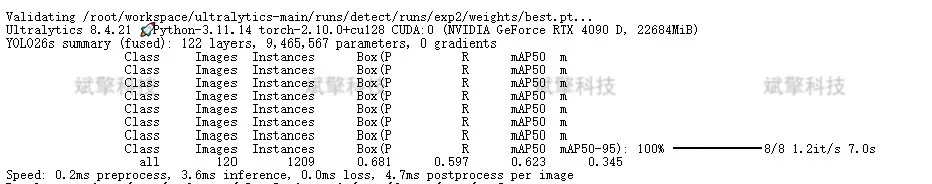
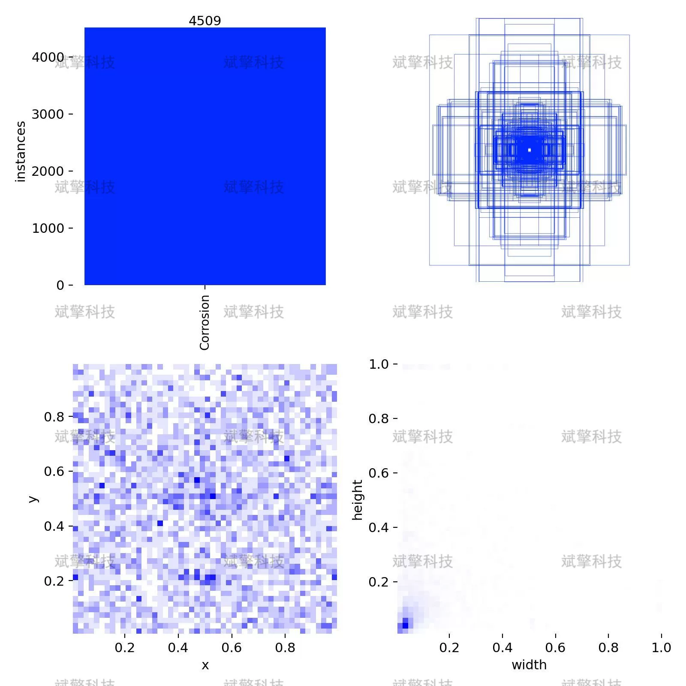
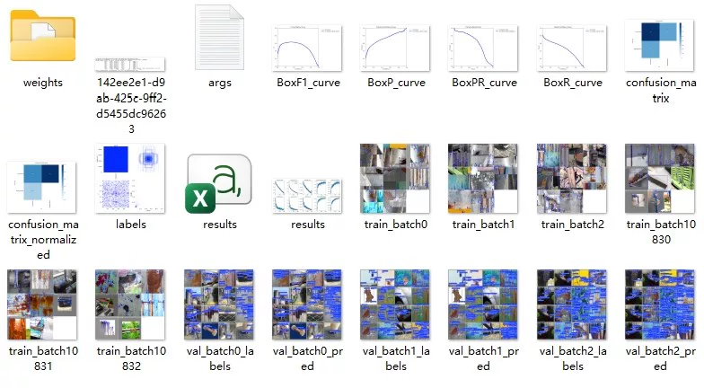
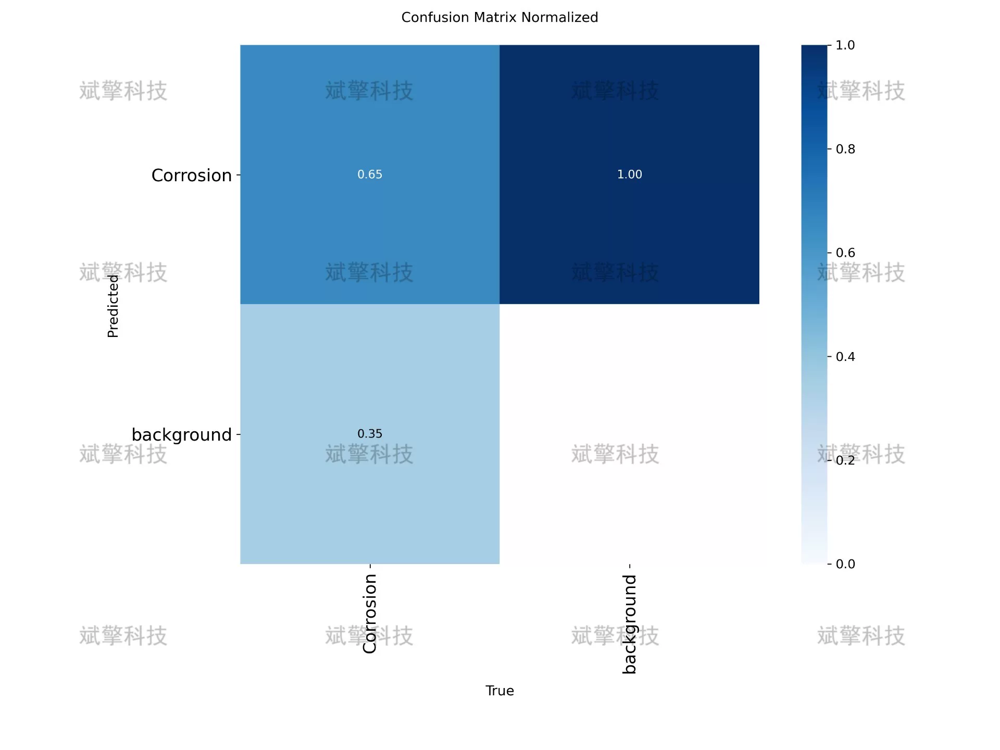
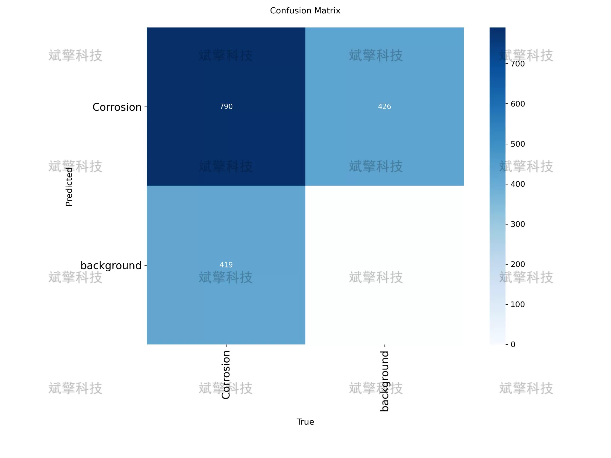
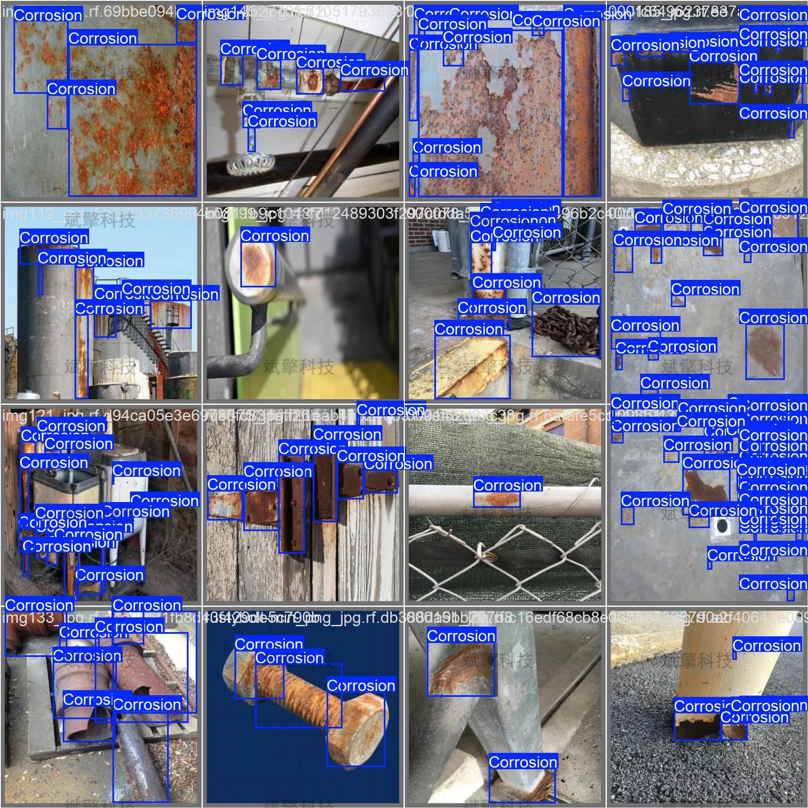
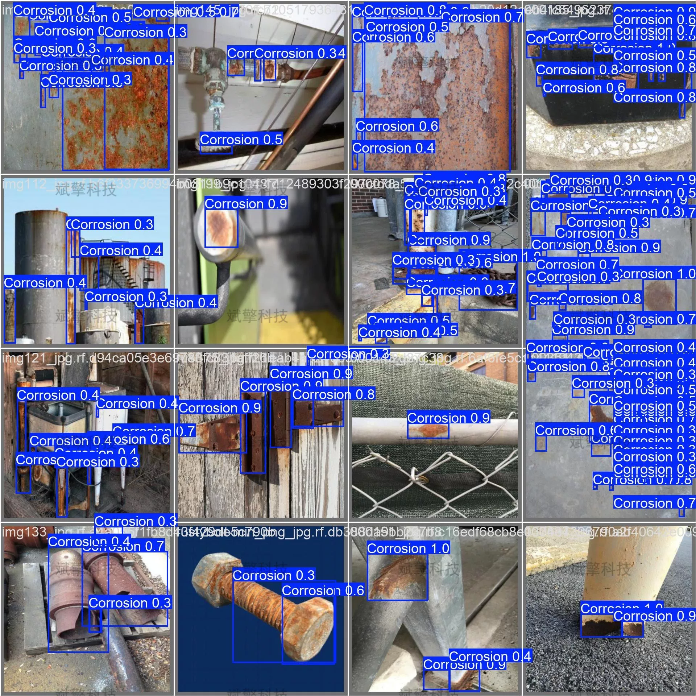

# YOLO26 Steel Corrosion and Rust Detection System | Model

## Body

YOLO26 Steel Corrosion and Rust Detection System | Model Based on YOLO26 Deep Learning for Steel Corrosion and Rust Identification Detection System (Project Source Code + Dataset + Model Weights + UI Interface + Python + Deep Learning + Remote Environment Deployment)

Steel materials are widely used in industrial infrastructure, but they are prone to corrosion and rusting due to their long-term exposure to humid and oxidizing environments, severely affecting structural safety and service life. To achieve automated detection of steel corrosion areas, this study has constructed a steel corrosion recognition system based on the YOLO26 object detection algorithm. The system adopts a single-class detection task, with a training set containing 450 labeled images, a validation set of 120, and a test set of 30. Through systematic analysis of the training process, loss function convergence, and evaluation metrics, the training process is stable and does not show obvious overfitting. This study provides a feasible technical path for intelligent detection of steel corrosion and indicates directions for subsequent optimization.

Training Set: 450 images, used for model parameter learning and optimization
Validation Set: 120 images, used for model hyperparameter tuning and training process monitoring
Test Set: 30 images, used for final model performance assessment
The dataset contains one target category, namely the corrosion area, with the category name "Corrosion". All images are labeled in YOLO format, including target category and bounding box coordinates (normalized center point coordinates, width, and height).

Free remote installation appointment. Unsuccessful full refund.
Purchase Enjoy the following resources (Baidu Drive automatically unlocked)
    Full source code of YOLO recognition detection project
    YOLO format dataset
    Training code + UI interface code
    Trained model + results image
    Software install package
    Add WeChat for remote installation (Automatically display WeChat ID after purchase) - Unsuccessful full refund

⚙️ Core Functional Modules
Detection Capability
    Image Detection: Upon upload, return detection boxes + category information
    Video Detection: Supports video files, analyzes frames accurately
    Camera Real-time Detection: Connects to USB camera for dynamic monitoring
Interaction and Control
    Target Selection: Choose one or more categories for detection
    Parameter Real-time Adjustment: Adjustable confidence threshold & IoU threshold, flexibly control accuracy
    Result Save: One-click save of image/video/camera detection results
System and Data
    User login registration: Supports password strength check + encryption storage
    Log recording: Automate operation and error information recording (with timestamp)

## Images

## Payment

Here is a pay link on Stripe ( https://buy.stripe.com/3cs8yP7sY87d0vu9AB ). Please contact me lonlonago@foxmail.com after funding $89, and I will send you a complete data files , thank you!

